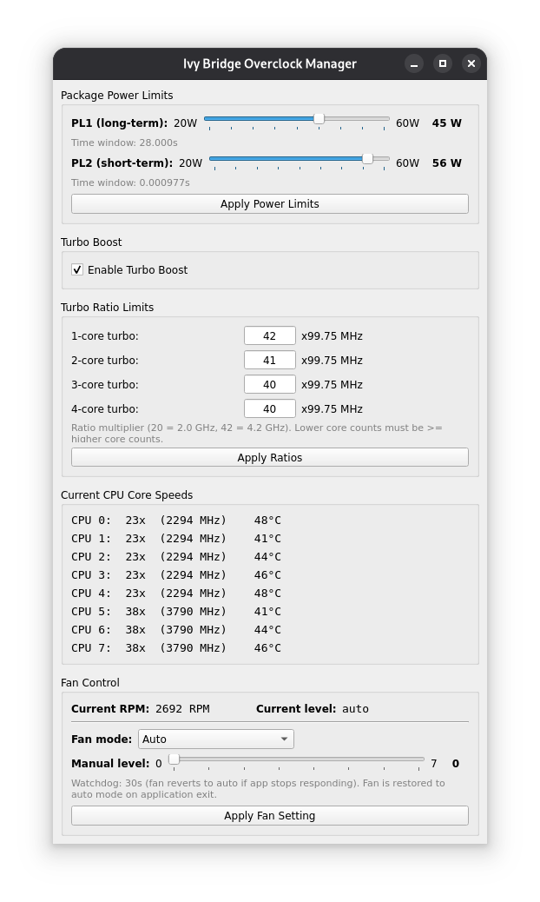

# T430 Overclock (Vibe Coded)



PyQt5 GUI for T430 CPU overclocking, power management, and fan control.

## Setup

Create and activate a virtual environment, then install dependencies:

```sh
python3 -m venv venv
source venv/bin/activate
pip install .
```

## Usage

Before running, ensure the `msr` kernel module is loaded:
```sh
sudo modprobe msr
```

For ThinkPad fan control, load the `thinkpad_acpi` module with fan control enabled:
```sh
sudo modprobe thinkpad_acpi fan_control=1
```

Run application (will run as root):

```sh
./run.sh
```
